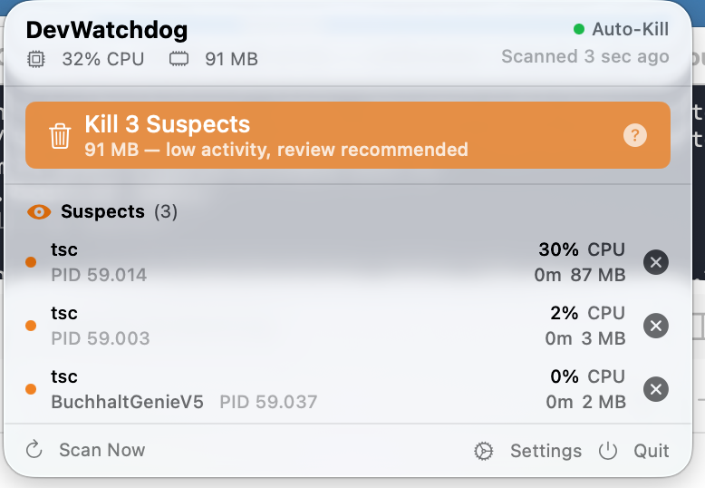
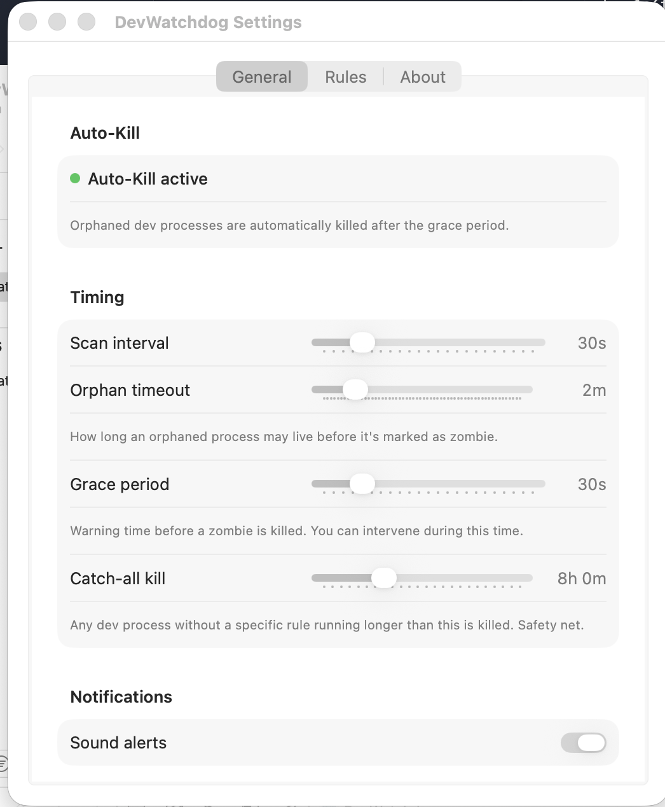
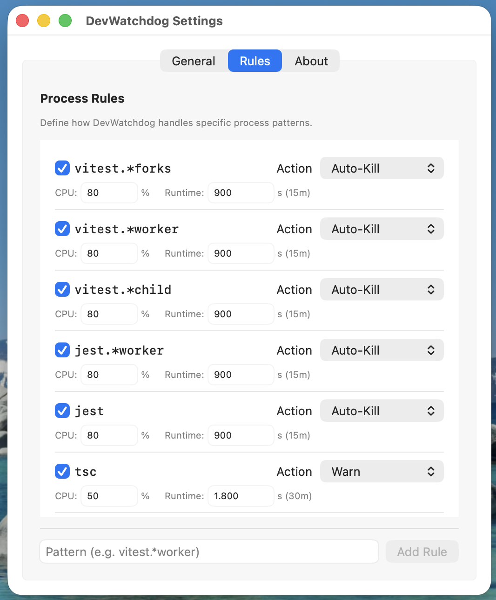

<p align="center">
  
</p>

# DevWatchdog

> Your Mac shouldn't be a space heater because of zombie Node.js processes.

**DevWatchdog** is a lightweight macOS menu bar app that monitors and automatically kills zombie development processes — orphaned Vitest workers, stale Jest runners, forgotten tsc builds, idle MCP servers, and Playwright browsers that outlive their test runs.

<p align="center">
  
</p>

## The Problem

If you work with Node.js, you've seen this:

```
PID    %CPU  TIME     COMMAND
48291  0.0%  2:15:33  node vitest/dist/chunks/forks.abc123.js
48292  0.0%  2:15:33  node vitest/dist/chunks/forks.abc123.js
...73 more...
```

73 Vitest fork workers sitting at 0% CPU for two hours. The parent process crashed, but the children stay orphaned forever — eating 1.2 GB of memory and never cleaning themselves up.

**Why does this happen?**
- **Vitest/Jest fork workers**: Spawned via `child_process.fork()`. If the parent dies, children never get the signal — they sit in an infinite event loop waiting for IPC messages that never come.
- **MCP servers**: Claude Code, Cursor, and other AI tools spawn MCP server processes that outlive their sessions — often with living parents that aren't actually using them anymore.
- **esbuild --service**: Stays running as a daemon even after the calling process exits.
- **Playwright browsers**: Chromium, Firefox, WebKit processes left behind after test runs.
- **next dev / tsc**: Long-running servers and compilers that accumulate over time.

## How It Works — The Decision Chain

Every 30 seconds, DevWatchdog scans and classifies each process:

```
Process detected
│
├── EXCLUDED?            → Ignore (Notion, Slack, Spotify, browsers...)
│
├── WHITELISTED?         → Show, never kill
│
├── ORPHAN + old enough? → ZOMBIE → Grace period → Auto-kill
│   (parent dead, nobody managing it — safe to kill)
│
├── maxRuntime exceeded? → ZOMBIE → Grace period → Auto-kill
│   (running way too long for its type — even with living parent)
│
├── Warn thresholds hit? → SUSPECT → Show, manual kill available
│   (has living parent, but looks suspicious)
│
└── Normal               → Not shown
```

**Key insight**: A process with a dead parent (PPID=1) will never clean itself up. That's the primary kill signal. For processes with living parents, each process type has a maximum runtime — a vitest worker should never run 20 minutes, a tsc build should never take 8 minutes.

## Features

### Emergency Mode (v3.0)

When system load spikes above your configured threshold, DevWatchdog enters **Emergency Mode** and tightens the kill criteria automatically. Suspects with high CPU or RSS get killed faster; whitelisted processes remain protected.

- Trigger: 5-minute load average crosses `emergencyLoadFactor × CPU-count` (default 1.5×)
- Behaviour: grace period shrinks, `maxRuntime` thresholds compress, `emergencyMinAgeSeconds` prevents killing fresh processes
- Exits automatically when load returns to normal
- Fully observable: every Emergency-triggered kill is tagged with its `KillTrigger`/`KillReason` in the session log

### What's New in v3.3

- **cwd-based project detection (G2, opt-in)** — resolves the working directory via `proc_pidinfo` and walks up to the nearest project root (`.git`, `package.json`, `Cargo.toml`, …), so processes inside monorepos get the correct project name instead of a parent-folder name. Enable under Settings → Entwickler → „cwd-Projekterkennung".
- **Signal-based dev classifier (G1, opt-in)** — four orthogonal heuristics (executable path, cwd, parent process, bundle identifier) replace word-list first-classification; hard exclusions for non-dev bundles (Slack, Notion, browsers) are overridden by a dev allowlist (VSCode, Cursor, iTerm2, Terminal, Warp). Enable under Settings → Entwickler → „Signal-Klassifier".
- **UI polish** — context-sensitive empty state copy, secondary panic button, pause/resume for process groups, correct Swap/Compressor row rendering, CPU colour scale relative to core count, unified German labels throughout.
- **Popover reliability fix** — LSUIElement apps must call `NSApp.activate` before showing a popover; fixes SwiftUI buttons not firing and transient dismissal not working (regression since v3.2).

### Observability (v3.1)

- **Insights tab** — weekly summary of what was killed, why, which projects/process types dominate, and how many CPU/RSS hours you reclaimed
- **Dev Filter** — narrow the watch surface to specific path patterns (`inclusionPatterns`) for laser-focused monitoring on a single project
- **Kill-reason audit** — every kill carries structured `KillTrigger` + `KillReason` metadata (orphan, maxRuntime, emergency-cpu, emergency-rss, manual, rule-override)
- **Match modes** — rule patterns support `glob`, `regex`, `substring`, and `exact` matching; migration-safe decoder keeps old rules working
- **Log export** — one-click JSON export (with secret redaction) via pasteboard or NSSavePanel
- **Structured logger (DWLogger)** — categorized, level-filtered logging; all `SessionLog` calls route through it with `kind→category` mapping

### Orphan-First Detection
- **Primary signal**: `isOrphan` (PPID=1) — parent is dead, nobody manages this process
- **Secondary signal**: `maxRuntime` exceeded — process-type-specific hard kill limits
- **Safety**: Whitelisted processes are always protected. 30s grace period before every auto-kill.

### Process-Type-Specific Timeouts

Every process type has its own maximum runtime, based on real-world thresholds:

| Process | Warn After | Auto-Kill After |
|---------|-----------|----------------|
| vitest workers | 10 min | **20 min** |
| vitest main | 10 min | **15 min** |
| jest | 10 min | **15 min** |
| tsgo (native) | 2 min | **5 min** |
| tsc | 4 min | **8 min** |
| next build / esbuild | 10 min | **20 min** |
| Playwright + browsers | 5 min | **10 min** |
| Percy visual testing | 30 min | **45 min** |
| next dev | 2 h | **3 h** |
| react-email dev | 1 h | **2 h** |
| MCP servers | 2 h | **4 h** |
| pnpm / npm | 15 min | **30 min** |
| *Any unmatched process* | 10 min | **8 h** (catch-all) |

### Sticky Action Bar

When processes need attention, two action buttons appear at the top of the menu (always visible, no scrolling needed):

- **"Kill N Zombies"** — Always green. Orphaned or expired processes. Safe to click without thinking.
- **"Kill N Suspects"** — Traffic light color based on risk:
  - **Green**: All suspects at 0% CPU — idle junk, safe to kill
  - **Yellow**: Some low CPU activity — probably safe, quick review recommended
  - **Red**: Active CPU usage (>50%) — likely running work, check the list first

### Smart App Exclusions

Non-dev Electron apps are automatically excluded: Notion, Slack, Discord, Spotify, Figma, 1Password, Microsoft apps, Linear, Obsidian, WhatsApp, Telegram, Signal, Zoom, browsers. Playwright-spawned browsers (under `ms-playwright/`) are correctly detected as dev processes.

### Batch Notifications

Instead of 73 individual alerts:
- **Detection**: "37 zombies detected (BuchhaltGenieV5: 30 jest workers, 5 esbuild, 2 vitest). Will kill after grace period."
- **After kill**: "37 zombies killed. Freed 1.2 GB memory."

### Menu Bar at a Glance
- **Green shield**: All clear, no zombies
- **Orange eye + count**: Suspect processes being watched
- **Red warning + count**: Zombies detected, auto-kill pending

### Fully Configurable

<p align="center">
  
  
</p>

### Per-Process Actions
- One-click kill for individual processes
- Kill All Zombies / Kill All Suspects buttons
- Shows PID, CPU%, memory, runtime, and project name

## Installation

### Download (Recommended)

1. Go to [Releases](https://github.com/Kanevry/DevWatchdog/releases/latest)
2. Download `DevWatchdog-<version>.dmg`
3. Open the DMG and drag **DevWatchdog** to the **Applications** folder
4. Launch DevWatchdog — it appears in your menu bar

> **Gatekeeper on first launch.** The DMG is signed with a Developer ID but is **not notarized yet**, so macOS will show a warning the first time you open the app. Two options:
>
> - **Right-click → Open** in the Applications folder, then confirm "Open" in the dialog. macOS remembers the choice.
> - Or, from Terminal: `xattr -d com.apple.quarantine /Applications/DevWatchdog.app`
>
> After that, DevWatchdog launches normally. You can verify the signature yourself: `codesign -dv --verbose=4 /Applications/DevWatchdog.app` should show `Developer ID Application: Bernhard Goetzendorfer (G3QZ66475M)`.

### Build from Source

Requires Xcode 16.2+ and macOS 15.0+.

```bash
git clone https://github.com/Kanevry/DevWatchdog.git
cd DevWatchdog
open DevWatchdog.xcodeproj
# Press Cmd+R to build and run
```

Or build from the command line:

```bash
xcodebuild -project DevWatchdog.xcodeproj \
  -scheme DevWatchdog \
  -configuration Release \
  -derivedDataPath build \
  build
```

The built app will be at `build/Build/Products/Release/DevWatchdog.app`.

## Settings

### General Tab

| Setting | Default | Description |
|---------|---------|-------------|
| Scan interval | 30s | How often to check for processes (10-120s) |
| Orphan timeout | 2 min | How long an orphaned process may live before becoming a zombie |
| Grace period | 30s | Warning time before auto-kill (user can intervene) |
| Catch-all kill | 8 h | Any unmatched dev process running longer than this is killed |
| Sound alerts | On | Play sound on zombie detection |
| Launch at login | Off | Start DevWatchdog automatically |

### Rules Tab

Custom rules with glob patterns. Each rule has:
- **Pattern**: Glob match on the command string (e.g., `vitest.*forks`)
- **Action**: Whitelist (never kill), Warn (show as suspect), Ignore (hide)
- **Warn thresholds**: CPU% and runtime before showing as suspect
- **Max runtime**: Hard kill limit — process becomes zombie when exceeded

All default rules can be customized or disabled.

## Process Lifecycle

```
Process starts
    │
    ▼
NORMAL (not shown)
    │  Warn thresholds exceeded
    ▼
SUSPECT (shown, manual kill available)
    │  maxRuntime exceeded OR becomes orphan
    ▼
ZOMBIE (shown, grace period running)
    │  30s grace period
    ▼
KILLED (auto-kill + notification)
```

| Transition | Trigger | Automatic? |
|-----------|---------|-----------|
| Normal → Suspect | Warn thresholds exceeded, or CPU >50%, or runtime >10min | Yes |
| Suspect → Zombie | maxRuntime exceeded, or parent dies + orphan timeout | Yes |
| Zombie → Killed | Grace period (30s) expires | **Yes, auto-kill** |
| Suspect → Killed | User clicks Kill or Kill All Suspects | Manual |

## System Requirements

- macOS 15.0 (Sequoia) or later
- Apple Silicon or Intel Mac
- No sandbox (needs `ps` and `kill` access)

## Privacy & Security

- **No network access**: DevWatchdog never connects to the internet
- **No telemetry**: Zero data collection
- **Local only**: All configuration stored in UserDefaults on your Mac
- **No sandbox**: Required to run `ps aux` and send `kill` signals
- **Open source**: Every line of code is auditable

## Tech Stack

| Component | Technology |
|-----------|-----------|
| Language | Swift 6.0 |
| UI | SwiftUI (MenuBarExtra) |
| Target | macOS 15.0+ |
| Process monitoring | `ps aux` via `Process()` |
| Notifications | `UserNotifications` framework |
| Autostart | `ServiceManagement` (SMAppService) |
| Persistence | `UserDefaults` |

## Contributing

Contributions are welcome! Here are some ideas:

- **New process rules**: Add patterns for Python, Ruby, Go, Rust, or other ecosystems
- **Kill history/log**: Track what was killed and when
- **Menubar CPU chart**: Mini sparkline showing CPU trend
- **Keyboard shortcuts**: Global hotkey for "Kill All Zombies"
- **Homebrew Cask**: Package for `brew install --cask devwatchdog`
- **Docker monitoring**: Track unhealthy Supabase/Redis containers

See [CONTRIBUTING.md](CONTRIBUTING.md) for development guidelines.

## FAQ

### Will this kill my dev server?
`next dev` has a 3-hour max runtime by default. If you need longer sessions, increase the max runtime in Settings > Rules. Whitelisted processes are never killed.

### Will this kill processes that are actively running tests?
No. A vitest worker only becomes a zombie after 20 minutes — a normal test run finishes in 5-8 minutes. If a worker is still running after 20 minutes, it's stuck.

### What about MCP servers while I'm using Claude Code?
MCP servers have a 4-hour max runtime. During active use they'll be suspects at most. If you close Claude Code, they become orphans and get killed after 2 minutes.

### Does it need root/admin access?
No. It only monitors and kills processes owned by your user account.

### How is this different from Activity Monitor?
Activity Monitor shows everything but does nothing automatically. DevWatchdog focuses specifically on developer tool zombies and handles them for you — with process-type-specific intelligence.

### Can I add rules for Python/Ruby/Go processes?
Yes! In Settings > Rules, add a new pattern (e.g., `python.*celery`) with your desired thresholds.

## License

[MIT](LICENSE) - Bernhard Goetzendorfer

---

*Built with frustration and Swift by a developer who was tired of zombie processes eating his RAM.*
